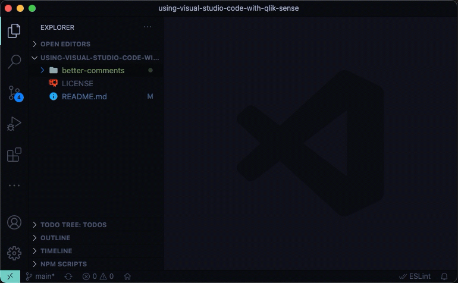
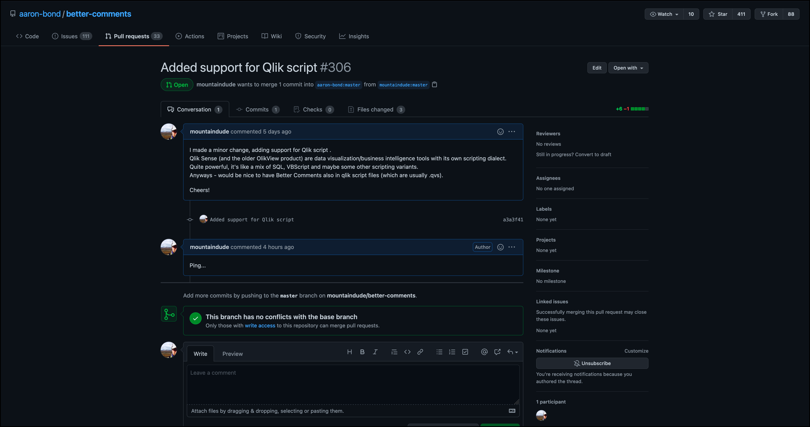

# Adding Qlik script to the "Better Comments" VSC extesion

As of February 1, 2021 the official "Better Comments" extension for Visual Studio Code does not support Qlik script.
A [pull request](https://github.com/aaron-bond/better-comments/pull/306) fixing this has been submitted but not yet merged.
Feel free to remind the developer to merge the pull request by adding a comment to the PR!

In order to solve this temporarily, a Qlik-enabled version of the extension is available in this folder.  
This packaged extension is called [better-comments-2.1.0.vsix](./better-comments-2.1.0.vsix) and is available in this repository.

The source code used to build this Qlik enabled version of the extension is available on [GitHub](https://github.com/mountaindude/better-comments).

If you want to review the changes done to the original extension (they are *very* minor), those are available [here](https://github.com/mountaindude/better-comments/commit/a3a3f41e1e6bc1c1691182dad7015061f94bfffb).

## Installing extension from file

In VSC:

1. Open the command palette, then select `Extensions: Install from VSIX...`
2. Navigate to the .vsix file provided in this repository
3. Install it
4. Configure it.

## Pull request

The PR looks like this at the time of this writing (Feb 2021). Let's hope it gets merged soon!

